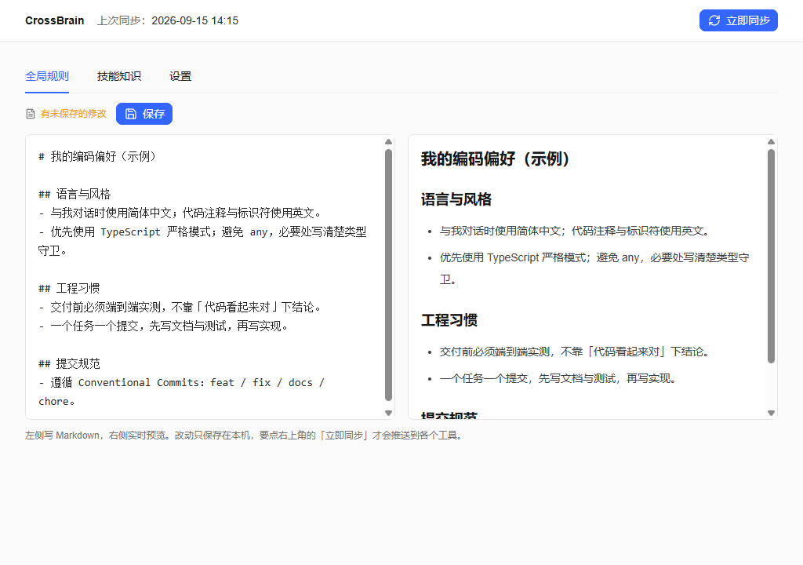
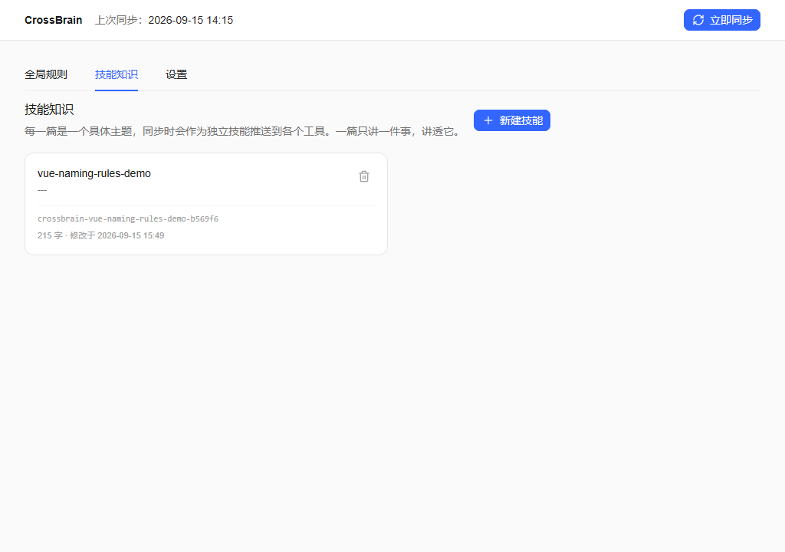
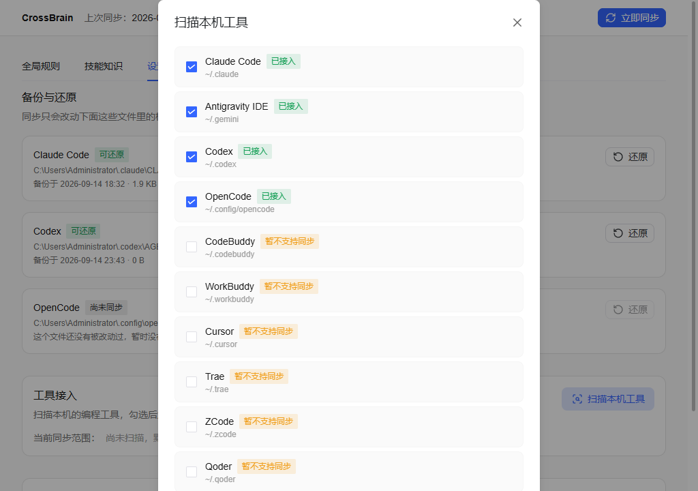
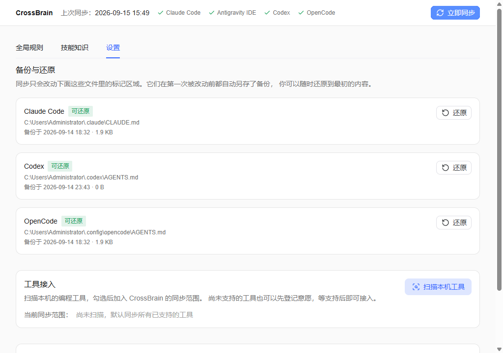

<div align="center">

# 🧠 CrossBrain（跨脑）

**Write your AI coding preferences once. Use them everywhere. / 写一次 AI 规则，处处可用。**

[](https://github.com/JasonOracle/CrossBrain/releases/latest)
[](https://github.com/JasonOracle/CrossBrain/releases/latest)
[](https://tauri.app)
[](#-testing--测试与质量)

*100% local · Zero network dependency · 100% 本地运行 · 零网络依赖*

**[中文](#-项目背景为什么做-CrossBrain)** | **[English](#-english-background--documentation)**

</div>

---

## 🇨🇳 项目背景：为什么做 CrossBrain

### 一个真实遇到的问题

2026 年，AI 编程工具爆发式增长。我的电脑上同时装着 **Claude Code、Codex、Antigravity IDE、OpenCode** 等 4 个以上的 AI 编程工具——这还不算完，市面上还有 Cursor、Trae、CodeBuddy 等十几个。每个工具都有自己的「记忆」：

- Claude Code 读 `~/.claude/CLAUDE.md`
- Codex 读 `~/.codex/AGENTS.md`
- Antigravity 读 `~/.gemini/config/rules/` 下的整个目录
- OpenCode 读 `~/.config/opencode/AGENTS.md`……

于是出现了三个让人崩溃的问题：

1. **重复劳动**：同一份「我的编码偏好」（用中文回答、优先 TypeScript、先给结论再给理由……）要在每个工具里配置一遍。改一条规则 = 手动改 N 个文件。
2. **配置漂移**：改了这个工具忘了那个，几个工具的「记忆」悄悄变得不一样，AI 在不同工具里表现不一致，排查起来毫无头绪。
3. **无法回溯**：哪天改坏了想恢复上周的版本？没有任何工具提供本地版本历史。

现有的云同步方案（各家自带的账号体系）**依赖网络**，在企业隔离内网里根本用不了，而且数据要上传到第三方服务器——我的个人工作习惯数据，凭什么要上云？

### CrossBrain 的解法：单一事实源（SSOT）+ 本地同步

CrossBrain 是一个 **100% 本地运行**的桌面应用，核心思路一句话：

> **你只在 CrossBrain 里维护一份「个人 AI 记忆」，它负责把这份记忆以每个工具各自正确的格式，同步到所有工具。**

| 痛点 | CrossBrain 的答案 |
|:---|:---|
| 重复劳动 | 一处编辑 → 一键同步到全部 4 个工具，格式各按各家规范（引用式 / 内联式 / 目录式） |
| 配置漂移 | 幂等同步引擎：多次执行结果一致；孤儿文件自动清理，绝不留「幽灵规则」 |
| 无法回溯 | `~/.ai-profile/` 自动 git 化，每次同步自动提交（ISO-8601 时间戳），随时回滚 |
| 数据上云 | 零网络依赖，纯本地文件读写；离线时同步照常工作 |
| 怕改坏配置 | 标记块注入协议 + 首次改动前自动备份 + 一键还原 + 完整卸载去痕 |

### 技术上值得一看的地方

- **Tauri v2 + Rust + Vue 3**：安装包仅 2.7 MB（对比 Electron 动辄 100 MB+），内存占用低。
- **Adapter 模式适配多工具**：每个 AI 工具的「规则文件在哪、用什么语法、有没有更高优先级的遮蔽文件」都不同，抽象成统一 Adapter trait（`Send + Sync`），新增工具只需实现差异部分——本项目用 7 步接入清单 + 二进制取证把接入新工具的成本压到半天以内。
- **数据安全是红线，不是特性**：SSOT 读取失败即整体中止（绝不把「读不到」当成「空」去清空用户技能）；写入边界白名单；首次改动用户文件前强制备份并弹窗告知硬链接断链影响。全部写成测试锁定。
- **167 个自动化测试 + CDP 真机端到端走查**：包括「复制真实用户目录跑真代码再比对零改动」的数据安全回归。

---

## 📸 功能截图 / Screenshots

### 全局规则编辑器：左侧 Markdown，右侧实时预览
### Global rules editor: Markdown on the left, live preview on the right



### 技能知识：每篇按需推送到各工具，由 AI 自动触发加载
### Skill knowledge: pushed as independent skills, lazy-loaded by each AI tool



### 备份与还原 / 工具接入 / 卸载去痕
### Backup & restore / tool onboarding / clean uninstall


### 扫描本机工具：勾选即可加入同步范围（未适配工具可登记意愿）
### Local tool scan: check to include in sync scope (register interest for unsupported tools)



### 一键同步：每个工具的同步结果一目了然
### One-click sync: per-tool results at a glance



---

## 🔧 工作原理 / How it works

```
~/.ai-profile/                     ← 单一事实源 SSOT（git 版本化）
├── global/rules.md                ← 你的全局 AI 编程偏好
├── knowledge/*.md                 ← 技能知识（每篇一个主题）
└── .git                           ← 每次同步自动提交，本地版本历史

          CrossBrain 同步引擎（幂等，失败即中止，绝不退化）

├── ~/.claude/CLAUDE.md            ← Claude Code：标记块 + @引用
├── ~/.codex/AGENTS.md             ← Codex：标记块 + 全文内联
├── ~/.gemini/config/rules/        ← Antigravity：目录 + 独立文件
└── ~/.config/opencode/AGENTS.md   ← OpenCode：标记块 + 全文内联
```

关键设计（详见 [`docs/tech/ARCHITECTURE.md`](docs/tech/ARCHITECTURE.md)）：

- **标记块注入协议**：只改各工具文件里属于 CrossBrain 的标记区域，你的原有内容原样保留；
- **写入边界白名单**：只写规则文件、`crossbrain-*` 技能目录、`*.crossbrain-backup` 备份——工具自身配置零接触；
- **ADR-14 红线**：源读取失败 = 整体中止。把「读不到」当「空」去同步，等于删光用户全部技能，这类错误用测试锁死，不靠自觉。

## ⬇️ 下载安装 / Install

从 [**Releases 页面**](https://github.com/JasonOracle/CrossBrain/releases/latest) 下载：

| 文件 | 适合 |
|:---|:---|
| `CrossBrain_1.0.0_x64_en-US.msi` | Windows 安装版（推荐） |
| `CrossBrain_1.0.0_x64-setup.exe` | Windows 安装版（NSIS） |
| `CrossBrain_1.0.0_portable.zip` | 免安装便携版，解压即用 |

> 未签名版本首次运行可能触发 SmartScreen 提示，点「仍要运行」即可。
> Unsigned builds may trigger a SmartScreen prompt on first run — choose "Run anyway".

**快速开始**：启动 → 向导自动检测本机工具 → 写下你的第一条规则 → 点「立即同步」。完成。

## 🧪 测试与质量

- **167 个 Rust 自动化测试**（单元 + 集成 + IPC 契约 + 四 Adapter 交叉一致性），全部通过
- **干跑回归**：复制真实用户目录跑真代码，逐项断言零改动
- **CDP 真机端到端走查**：WebView2 远程调试 + Playwright 驱动真实窗口逐页验证
- **离线测试**：模拟断网验证同步不受影响
- 开发过程全程 ADR（架构决策记录）驱动，当前 15+ 条

## 🗺️ Roadmap

- [x] v1.0 — Claude Code / Antigravity / Codex / OpenCode 接入，SSOT git 版本化，Windows 安装包
- [ ] v1.5 — CodeBuddy / WorkBuddy / Cursor / Trae / ZCode / Qoder 接入（落点已探测，待 Spike 实证）
- [ ] v2 — macOS / Linux 支持，规则模板市场

## 🛠️ 技术栈

**前端** Vue 3 + TypeScript + Naive UI + Tailwind CSS 4 · **后端** Rust + Tauri v2 · **测试** cargo test + Playwright(CDP) · **构建** WiX + NSIS

---

<div align="center">

---

# 🇬🇧 English Background & Documentation

## Why I built CrossBrain

In 2026 the AI coding tool landscape exploded. I run 4+ AI coding assistants on one machine — Claude Code, Codex, Antigravity IDE, OpenCode — and there are a dozen more (Cursor, Trae, CodeBuddy…). Each tool keeps its own "memory" in a different file, in a different format, at a different path.

That creates three painful problems:

1. **Duplicated effort** — the same "my coding preferences" document must be configured in every tool. Changing one rule means manually editing N files.
2. **Configuration drift** — update one tool, forget another. Your assistants silently diverge and behave inconsistently, with no way to tell why.
3. **No way back** — break your config and you can't restore last week's version. Nothing offers local version history.

Cloud-based sync (vendor account systems) **requires network access** — a non-starter inside corporate firewalls — and uploads your personal working habits to third-party servers.

### The solution: a Single Source of Truth + local sync

CrossBrain is a **100% local** desktop app with a one-line philosophy:

> Maintain ONE "personal AI memory" in CrossBrain; it syncs that memory to every tool, in each tool's own correct format.

| Problem | CrossBrain's answer |
|:---|:---|
| Duplicated effort | Edit once → sync to all 4 tools, each in its native format (reference / inline / directory) |
| Config drift | Idempotent sync engine: repeated runs converge; orphaned files are cleaned up automatically |
| No history | `~/.ai-profile/` is auto-git-ified; every sync auto-commits with an ISO-8601 timestamp |
| Cloud privacy | Zero network dependency; sync works fully offline |
| Fear of breaking things | Marker-block injection protocol, automatic pre-modification backups, one-click restore, clean uninstall |

### Engineering highlights

- **Tauri v2 + Rust + Vue 3**: the installer is only 2.7 MB (vs 100 MB+ for typical Electron apps).
- **Adapter pattern**: every tool differs in where rules live, what syntax they accept, and whether higher-priority "override files" shadow them. A unified `Adapter` trait (`Send + Sync`) isolates those differences — a 7-step onboarding checklist plus binary forensics gets a new tool integrated in under half a day.
- **Data safety as a red line, not a feature**: if the SSOT read fails, the whole sync aborts (treating "unreadable" as "empty" would wipe the user's skills); writes are bounded by a whitelist; user files are backed up before first modification, with the hardlink-breakage impact disclosed up front. All of this is pinned by tests.
- **167 automated tests + real-app CDP end-to-end walkthroughs**, including data-safety regressions that copy the real user directory, run the actual code, and assert zero changes.

## Features

- **Global rules editor** — Markdown editing with live preview; saving and syncing are strictly separated.
- **Skill knowledge base** — each note becomes an independent skill in every tool, lazy-loaded by the AI on demand (no context pollution).
- **Tool onboarding** — scans your machine for 10 common AI coding tools (read-only); check the ones you want in scope. Register interest for unsupported tools.
- **Local version history** — the profile directory is a real git repository; every successful sync commits automatically. No git installed? Silently degrades without blocking sync.
- **Backup & restore** — every file touched gets a pre-modification `.crossbrain-backup`; restore anytime; uninstall removes every trace.

## How it works

```
~/.ai-profile/                     ← Single Source of Truth (git-versioned)
├── global/rules.md                ← your global AI coding preferences
├── knowledge/*.md                 ← skill knowledge, one topic per note
└── .git                           ← auto-commit on every sync

          CrossBrain sync engine (idempotent; aborts on read failure)

├── ~/.claude/CLAUDE.md            ← Claude Code: marker block + @reference
├── ~/.codex/AGENTS.md             ← Codex: marker block + full inline copy
├── ~/.gemini/config/rules/        ← Antigravity: directory + standalone file
└── ~/.config/opencode/AGENTS.md   ← OpenCode: marker block + full inline copy
```

See [`docs/tech/ARCHITECTURE.md`](docs/tech/ARCHITECTURE.md) for details.

## Install

Grab the latest build from the [**Releases page**](https://github.com/JasonOracle/CrossBrain/releases/latest): `CrossBrain_1.0.0_x64_en-US.msi` (installer), `CrossBrain_1.0.0_x64-setup.exe` (NSIS), or `CrossBrain_1.0.0_portable.zip` (portable, no install needed).

**Quick start**: launch → the wizard detects your tools → write your first rule → hit "Sync now". Done.

## Testing & quality

167 Rust tests (unit + integration + IPC contract + four-adapter cross-consistency), all passing; dry-run regressions that copy the real user directory and assert zero modifications; Playwright-over-CDP walkthroughs against the real window; offline tests; ADR-driven development (15+ decision records).

## Roadmap

- [x] v1.0 — Claude Code / Antigravity / Codex / OpenCode adapters, SSOT git versioning, Windows installers
- [ ] v1.5 — CodeBuddy / WorkBuddy / Cursor / Trae / ZCode / Qoder (endpoints probed, pending spike validation)
- [ ] v2 — macOS / Linux, rule template marketplace

## License / 许可

MIT

</div>
